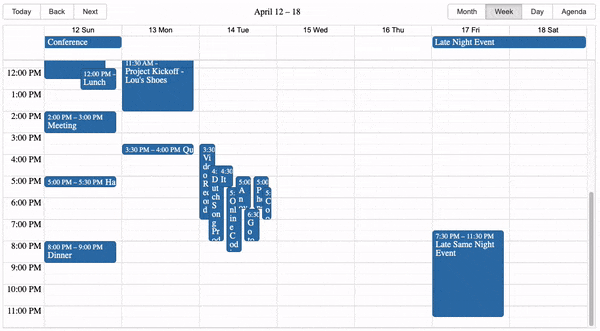

# react-big-calendar

An events calendar component built for React and designed for modern browsers (read: not IE) and uses flexbox over the classic tables-caption approach.

<p align="center">
  
</p>

[**DEMO and Docs**](https://jquense.github.io/react-big-calendar/examples/index.html)

Inspired by [Full Calendar](http://fullcalendar.io/).

## Use and Setup

`yarn add react-big-calendar` or `npm install --save react-big-calendar`

Include `react-big-calendar/lib/css/react-big-calendar.css` for styles, and make sure your calendar's container
element has a height, or the calendar won't be visible. To provide your own custom styling, see the [Custom Styling](#custom-styling) topic.

## Starters

- [react-big-calendar](https://github.com/arecvlohe/rbc-starter)
- [react-big-calendar with drag and drop](https://github.com/arecvlohe/rbc-with-dnd-starter)
- [react-big-calendar with TypeScript and React hooks bundled with Vite](https://github.com/christopher-caldwell/react-big-calendar-demo)

## Run examples locally

```sh
$ git clone git@github.com:jquense/react-big-calendar.git
$ cd react-big-calendar
$ yarn
$ yarn storybook
```

- Open [localhost:3000/examples/index.html](http://localhost:3000/examples/index.html).

### Localization and Date Formatting

`react-big-calendar` includes four options for handling the date formatting and culture localization, depending
on your preference of DateTime libraries. You can use either the [Moment.js](https://momentjs.com/), [Globalize.js](https://github.com/jquery/globalize), [date-fns](https://date-fns.org/), [Day.js](https://day.js.org) localizers.

Regardless of your choice, you **must** choose a localizer to use this library:

#### Moment.js

```js
import { Calendar, momentLocalizer } from 'react-big-calendar'
import moment from 'moment'

const localizer = momentLocalizer(moment)

const MyCalendar = (props) => (
  <div>
    <Calendar
      localizer={localizer}
      events={myEventsList}
      startAccessor="start"
      endAccessor="end"
      style={{ height: 500 }}
    />
  </div>
)
```

#### Globalize.js v0.1.1

```js
import { Calendar, globalizeLocalizer } from 'react-big-calendar'
import globalize from 'globalize'

const localizer = globalizeLocalizer(globalize)

const MyCalendar = (props) => (
  <div>
    <Calendar
      localizer={localizer}
      events={myEventsList}
      startAccessor="start"
      endAccessor="end"
      style={{ height: 500 }}
    />
  </div>
)
```

#### date-fns v2

```js
import { Calendar, dateFnsLocalizer } from 'react-big-calendar'
import format from 'date-fns/format'
import parse from 'date-fns/parse'
import startOfWeek from 'date-fns/startOfWeek'
import getDay from 'date-fns/getDay'
import enUS from 'date-fns/locale/en-US'

const locales = {
  'en-US': enUS,
}

const localizer = dateFnsLocalizer({
  format,
  parse,
  startOfWeek,
  getDay,
  locales,
})

const MyCalendar = (props) => (
  <div>
    <Calendar
      localizer={localizer}
      events={myEventsList}
      startAccessor="start"
      endAccessor="end"
      style={{ height: 500 }}
    />
  </div>
)
```

#### Day.js

Note that the dayjsLocalizer extends Day.js with the following plugins:

- [IsBetween](https://day.js.org/docs/en/plugin/is-between)
- [IsSameOrAfter](https://day.js.org/docs/en/plugin/is-same-or-after)
- [IsSameOrBefore](https://day.js.org/docs/en/plugin/is-same-or-before)
- [LocaleData](https://day.js.org/docs/en/plugin/locale-data)
- [LocalizedFormat](https://day.js.org/docs/en/plugin/localized-format)
- [MinMax](https://day.js.org/docs/en/plugin/min-max)
- [UTC](https://day.js.org/docs/en/plugin/utc)

```js
import { Calendar, dayjsLocalizer } from 'react-big-calendar'
import dayjs from 'dayjs'

const localizer = dayjsLocalizer(dayjs)

const MyCalendar = (props) => (
  <div>
    <Calendar
      localizer={localizer}
      events={myEventsList}
      startAccessor="start"
      endAccessor="end"
      style={{ height: 500 }}
    />
  </div>
)
```

## Custom Styling

Out of the box, you can include the compiled CSS files and be up and running. But, sometimes, you may want to style
Big Calendar to match your application styling. For this reason, SASS files are included with Big Calendar.

```
  @import 'react-big-calendar/lib/sass/styles';
  @import 'react-big-calendar/lib/addons/dragAndDrop/styles'; // if using DnD
```

SASS implementation provides a `variables` file containing color and sizing variables that you can
update to fit your application. _Note:_ Changing and/or overriding styles can cause rendering issues with your
Big Calendar. Carefully test each change accordingly.

## Join The Community

Help us improve Big Calendar! Join us on [Slack](https://join.slack.com/t/bigcalendar/shared_invite/zt-2tjko9jqq-ZeXs1U01zulNM~FRU9YTFA).
(Slack invite links do expire. If you can't get in, just file an issue and we'll get a new link.)

## Translations

- [العربية](/docs/README-ar.md)
